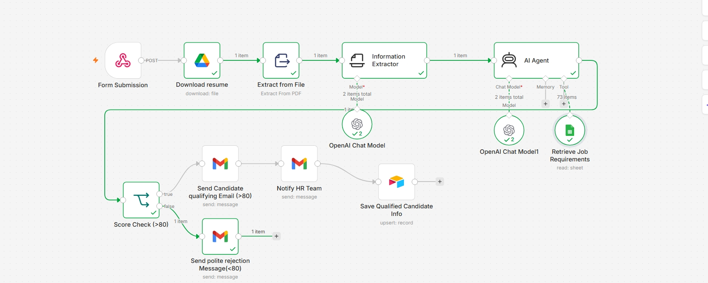
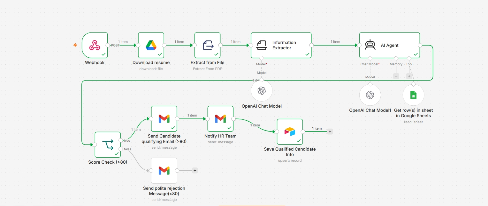

# AI-Hiring-Candidate-Screening-Workflow
An AI-powered recruitment automation workflow built with n8n that streamlines the candidate screening process by comparing resumes against job requirements stored in a Google Sheets knowledge base.
The workflow automatically retrieves the relevant job requirements, analyzes candidate resumes using OpenAI, evaluates skills and experience, calculates a match score, identifies strengths and missing skills, and generates a hiring recommendation. The completed evaluation is then emailed to the HR team, while the candidate's information and assessment are stored in Airtable for easy tracking and future reference.

Features
🤖 AI-powered resume analysis
📄 Automatic job requirement retrieval from Google Sheets
🎯 Candidate skill and experience matching
📊 AI-generated match score and hiring recommendation
💪 Strengths and missing skills analysis
📧 Automatic HR notification via email
🗂️ Candidate evaluation storage in Airtable
⚡ Fully automated workflow built with n8n
Technologies Used
n8n
OpenAI API
Google Sheets
Airtable
Gmail
REST APIs
JSON
Prompt Engineering

This workflow demonstrates how AI can automate the initial stages of recruitment, helping HR teams reduce manual screening time, improve consistency, and accelerate the hiring process.
### Screenshots
### Output 1

### Output 2 

